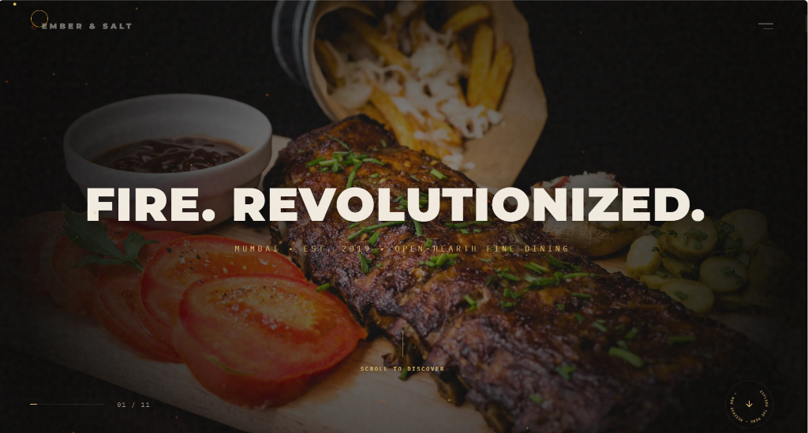

# EMBER & SALT — Live-Fire Fine Dining

A premium, cinematic scrollytelling website for **Ember & Salt**, an open-hearth fine-dining restaurant in Bandra West, Mumbai.

Built in the style of an Awwwards Site-of-the-Day product showcase (inspired by Locomotive/Active Theory builds), this single-page web experience prioritizes heavy cinematic atmosphere, fluid motion, and responsive typography over standard grid templates.

---

## 🔗 Live URL
Experience the site live: **[Live Site](https://restaurantdemodevinedge.netlify.app/)**

---

## 📸 Preview


---

## ✨ Features & Polish

1. **11 Pinned Scrollytelling Scenes**  
   An expansive scroll journey alternating between zoom-in parallax (Hero, Ingredients), zoom-out framing (Source), text-grid dissolves, and signature 3D dish showcases.
   
2. **Smooth Inertial Scrolling**  
   Integrated with **Lenis** to normalize mouse-wheel increments, providing a buttery-smooth scrolling experience across all platforms.
   
3. **Scroll-Scrubbed Easing**  
   GSAP ScrollTrigger timelines use a smoothed `scrub: 1.2` catch-up setting. Elements glide with cinematic momentum instead of tracking the scrollbar 1:1.
   
4. **Soft Lens Focus Reveals**  
   Replaces generic text-scramble effects. Display headlines dissolve word-by-word, starting scaled up and blurred, then sharpening and scaling down as you scroll.
   
5. **3D Simulated Dish Pedestals**  
   Dishes in Scenes 04 (Tomahawk), 07 (Lobster), and 09 (Dessert) are wrapped in custom CSS perspective layers. Scrolling triggers a full 360° Y-axis spin, scaling up the dish, shifting its skewed lighting drop-shadow, and triggering active steam wisps.
   
6. **Unified HTML5 Canvas Emitters**  
   A single, fixed canvas renders context-aware particle effects:
   - Upward-drifting warm embers in the Hero and Hearth scenes.
   - Gravity-driven sparks spitting from the SVG branching fuse tip.
   - Downward-drifting smoke motes in the kitchen glaze scene.
   - A cascading monospace word-fragment grid ("SEAR", "BASTE", "PLATE") that dissolves on scroll to reveal the plated dish.
   
7. **Global Navigation Chrome**  
   Fixed elements frame the viewport:
   - **Top Left**: Ember & Salt wordmark with a pulsing flame glyph.
   - **Top Right**: Interactive menu toggle opening a glassmorphic nav drawer.
   - **Bottom Left**: Active progress rail updating the scene index (`01 / 11`).
   - **Bottom Right**: A rotating SVG badge showing context labels. Clicking the badge automatically scrolls to the next logical scene.
   - **Cursor**: Custom dual-dot and trailing ring cursor that reacts to interactive hover targets.
   
8. **Automated Ticket Reservation**  
   An overlay booking card enforcing same-day-minimum date parameters, generating unique serial tickets (`ES-XXXX`) upon successful submission.

---

## 🛠️ Technology Stack

*   **Core**: HTML5, Vanilla CSS, Modern JavaScript
*   **Compiler/Bundler**: Vite
*   **Animation**: GSAP (GreenSock Animation Platform) + ScrollTrigger
*   **Smooth Scroll**: Lenis
*   **Typography**: Montserrat (Display Headers), IBM Plex Mono (Technical Details), Manrope & Manrope (Body Text)
*   **Media Assets**: High-contrast, fine-dining photography from Unsplash

---

## 🚀 Local Development

### 1. Prerequisites
Ensure you have [Node.js](https://nodejs.org/) installed.

### 2. Install Dev Dependencies
Clone the repository and run:
```bash
npm install
```

### 3. Start Development Server
Launch the local Vite server:
```bash
npm run dev
```
Open the output URL (typically `http://localhost:5173/`) in your browser.

### 4. Build for Production
Bundle and compress assets for deployment:
```bash
npm run build
```
Vite will compile and output static files to the `./dist` directory.

### 5. Local Production Preview
Test the compiled production bundle locally:
```bash
npm run preview
```

---

## ♿ Accessibility & Motion
*   **Reduced Motion**: Full fallback implementation using `prefers-reduced-motion` media queries. Disables inertial scroll, 3D Y-axis rotations, and canvas rendering, replacing them with simple, clean opacity fades.
*   **Semantic Layouts**: Organizes scrollytelling scenes using structural HTML5 elements (`<section>`, `<nav>`, `<header>`) and labels inputs appropriately.
